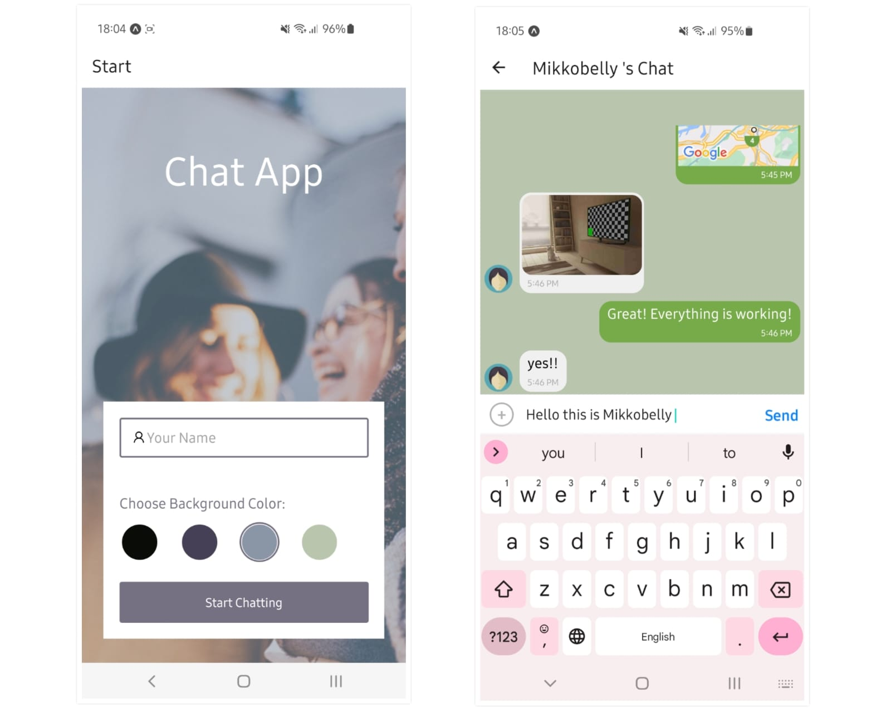

# Chat App

## Overview

Chat App is an application for mobile device (both Androind and iOS) which provides users with a chat interface and options to share images and their location.
It is a cross-platform native and real-time application developed using Expo and written in React Native. Library Gifted Chat is used to create chat interface with customized message bubbles. Users can choose a theme color on the start page before joining the chat, send images as well as their current location in a map view. Google firebase is used to authenticate users anonymously and store data in the cloud storage and the local storage.

## Key features
- In the start page, users can enter their name and choose a background color for the chat screen before joining the chat.
- Users can send images and thier location
- Data gets stored online and offline

## Technologies 

* React Native
* Expo
* Gifted Chat
* Google firebase

## Dependencies 

    "@react-native-async-storage/async-storage": "~1.17.3",
    "@react-native-community/masked-view": "^0.1.11",
    "@react-native-community/netinfo": "9.3.5",
    "@react-native-firebase/storage": "^17.3.1",
    "@react-navigation/native": "^6.1.1",
    "@react-navigation/stack": "^6.3.10",
    "expo": "~47.0.9",
    "expo-camera": "~13.1.0",
    "expo-image-picker": "~14.0.2",
    "expo-location": "~15.0.1",
    "expo-permissions": "~14.0.0",
    "expo-status-bar": "~1.4.2",
    "firebase": "8.2.9",
    "react": "18.1.0",
    "react-native": "0.70.5",
    "react-native-gesture-handler": "~2.8.0",
    "react-native-gifted-chat": "^1.1.0",
    "react-native-maps": "1.3.2",
    "react-native-reanimated": "~2.12.0",
    "react-native-screens": "~3.18.0",
    "react-navigation": "^4.4.4"

## Dev Dependencies

    "@babel/core": "^7.20.0"

## Setting up the development environment

- Clone the repository: `git clone https://github.com/Mikkobelly/ChatApp`
- Install Expo CLI as a global npm package: `npm install -g expo-cli`
- Install yarn globally: `npm install -g yarn`
 - Install all project dependencies using yarn: `yarn`
 - Head over to https://expo.dev/, create an account and log in via terminal with `expo login`
 - Follow expo CLI's instructions depending on your preferred simulator/emulator (XCode, Android Studio, Expo Go)
 - Start the project: `npm start` or `expo start`
 - In case Expo cannot detect the running project, try running it with `npx expo start --tunnel`

## App showcase

